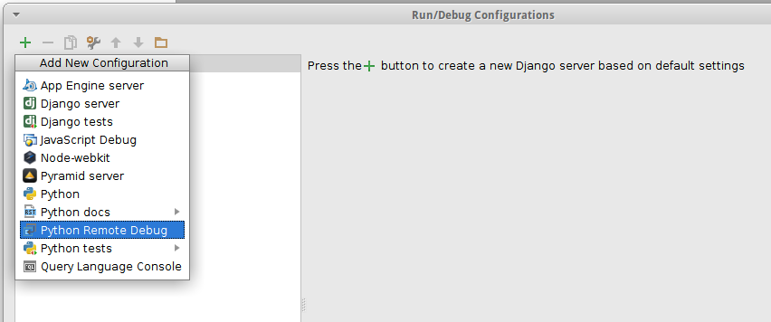
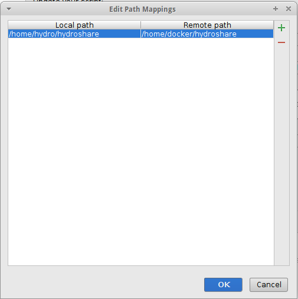
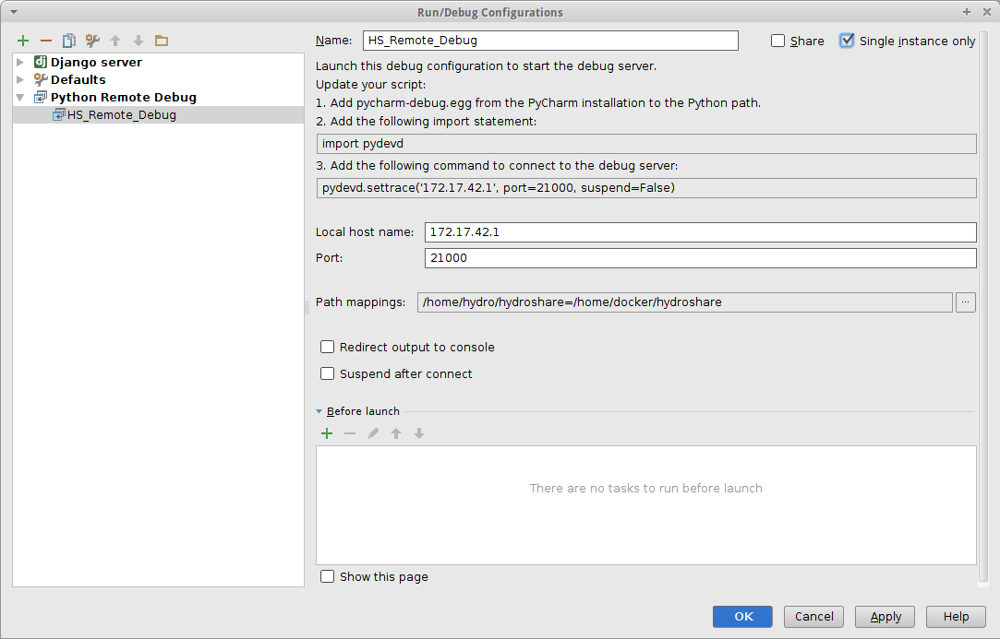

# HydroShare Development Environment - PyCharm Remote Debugging

This document is part of the [Hydroshare Developers' Guide](https://github.com/hydroshare/hydroshare2/wiki/Hydroshare-Developers'-Guide). 

This guide describes how to configure PyCharm for remote debugging Hydroshare python code running inside a docker container:

### Step-1: PyCharm Configuration
* Start PyCharm. Open the "**hydroshare**" project if it not already loaded. 
* From the "**Run**" menu select "**Edit Configurations**". 
* In the "**Run/Debug Configurations**" window click on the "**+**" toolbar button to create a new debug configuration. 
* From the "**Add New Configuration**" dropdown menu, select "**Python Remote Debug**" option
* In the "**Name**" field, type a name for the configuration (.e.g. HS_Remote_Debug).
* In the "**Local host name**" field, type(the host IP address): **172.17.42.1**
* In the "**Port**" field, type: **21000**
* For the "**Path mappings**" field click the button (with three dots) to open the Edit Path Mappings window. Click the "+" toolbar button on this window to insert a new row. 
* Under the "**Local path**" column, type (this is directory where you have cloned hydroshare): **/home/hydro/hydroshare**  
* Under the "**Remote path**" column, type: **/home/docker/hydroshare**
* Then click "**OK**" to close this window
* Uncheck the checkbox "**Redirect output to console**"
* Uncheck the checkbox "**Suspend after connection**"
* Check the checkbox "**Single instance only**"
* Click on the "**Apply**" button. Then click on "**OK**" button to close this window.









### Step-2:Mounting PyCharm Debug Modules to Hydroshare Container
* Create a new directory called "pycharm-debug" under the "/home/hydro/" directory
* Change the permission for the "pycharm-debug" folder (type: sudo chmod -R 777 pycharm-debug)
* Unzip the "pycharm-debug.egg" file (located under /home/hydro/pycharm-[version]/) to the above "pycharm-debug" folder you created.
* Open the "docker-compose.yml" file in PyCharm (or any other editor). In the 'volumes:' section of the 'hydroshare:' add the following line (as the last line in this section of the docker-compose.yml):
```
- "/home/hydro/pycharm-debug:/home/docker/pycharm-debug"
```

**NOTE:** Here it is assumed you are also mounting the hydroshare development volume (- "/home/hydro/hydroshare:/home/docker/hydroshare"). Without it PyCharm debugging won't work.

{Screenshot to go here}

### Step-3: Editing Hydroshare Code to Activate Debugging
* Open the "\__init\__.py" located under the 'hs_core/views/' in PyCharm. Insert the following 4 lines of code as first 4 lines of code inside the function "my_resources"

```
import sys
sys.path.append("/home/docker/pycharm-debug")
import pydevd
pydevd.settrace('172.17.42.1', port=21000, suspend=False)
```

* Put a breakpoint (this is only to test that debugging works) inside the "my_resources" function on the following line:

```
frm = FilterForm(data=request.REQUEST)
```
### Step-4: Start the PyCharm Debug Server
* From the PyCharm "Run" menu, select option "Debug 'HS_Remote_Debug'"  At this point within PyCharm console window you should see the following output:

```
Waiting for connection...
Starting debug server at port 21000
Use the following code to connect to the debugger:
import pydevd
pydevd.settrace('172.17.42.1', port=21000, suspend=False)
```
### Step-4: Starting Docker Containers
* Run ```docker-compose stop``` to stop containers if they are running
* Run ``docker-compose up``` to recreate/start containers. This should pick changes you made to the docker-compose.yml file in Step-2.
* Run ```docker-compose ps``` to make sure all containers are up

### Step-5: Test Remote Debugging
* Using the browser navigate to the hydroshare home page. Login to the site.Then select "RESOURCES" menu option. The purpose of selecting this menu option is to run the 4 lines of debugging setup related code that you put inside the "my_resources" function (as described under Step-3). This allows the code running in the container to connect with PyCharm for remote debugging. Once you execute this debug setup code block (by selecting "RESOURCES" menu option), you can put breakpoints anywhere in python code and be able to hit those breakpoints.
* At this point you should hit the breakpoint that you set in Step-3. Also you should see the following PyCharm console output (which indicates that PyCharm is connected to the debugger):
```
Waiting for connection...
Starting debug server at port 21000
Use the following code to connect to the debugger:
import pydevd
pydevd.settrace('172.17.42.1', port=21000, suspend=False)
Connected to pydev debugger (build 135.1057)
```

### NOTES: 
If for any reason you stop the PyCharm debugger and then you restart the debugger, you have to stop the containers and then start those containers in order for the debugging to work.Then do Step-5.
